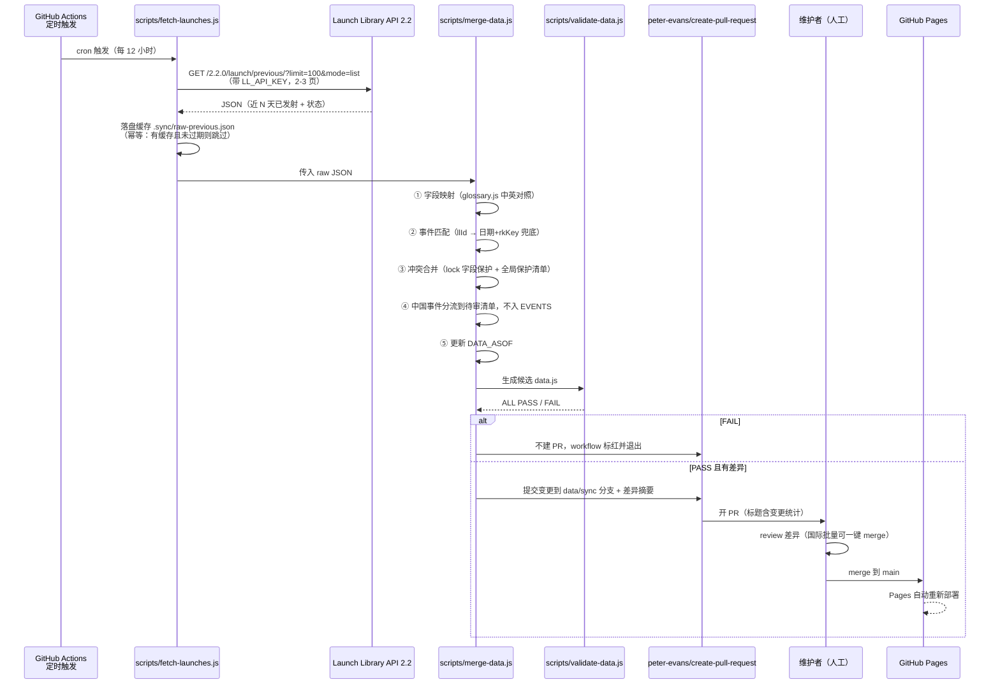
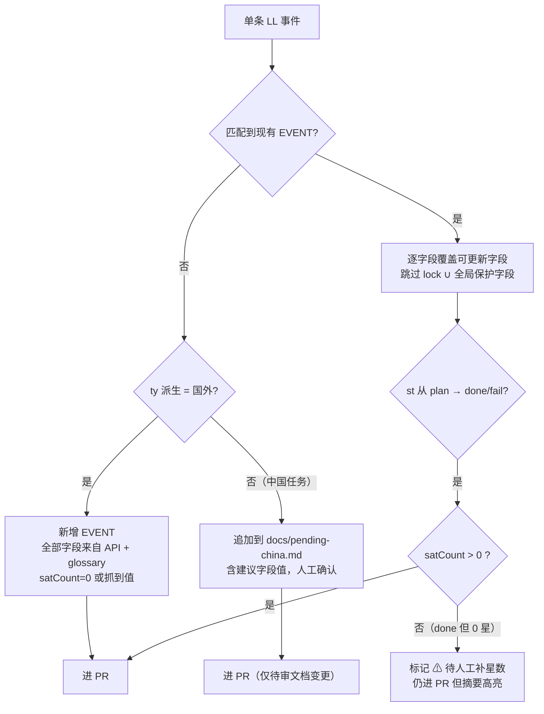

# 设计方案 — v8 数据自动更新与公网部署

| 文档信息 | 内容 |
|---|---|
| 方案版本 | v8 设计稿（对应 PRD v1.0 backlog B1-B7） |
| 编制 | 架构组 · 高见远（Gao） |
| 日期 | 2026-09-02 |
| 适用基线 | 网站 v7（124 事件 / 41 型火箭 / 25 家公司主页 / 数据字典 Stage 1） |
| 硬约束 | **纯静态、无构建流程、本地双击可用** —— 全部设计不得引入 npm install / 打包器 / 运行时后端 |

---

## 0. 总体思路（一页看懂）

v8 的核心命题是：**让数据流动起来，同时不动摇单文件架构**。

三条主线：

1. **B2 部署（最先做，半天工作量）**：主 HTML 改以 `index.html` 为规范名，原中文名文件降级为 3 行跳转存根（本地双击习惯保留），推送 GitHub Pages 即上线。零构建。
2. **B5/B3 数据口径（第二做）**：`OPERATORS.inOrbit` 从静态快照改为 `inOrbitBase + EVENTS 派生累加`，从此"在轨 N 颗"随每次录入自动长；10-12 月真实数据回填只是数据录入工作，配套校验规则即可。
3. **B1 自动化（第三做）**：GitHub Actions 定时抓 Launch Library 2.2 → Node 零依赖脚本做字段映射 + 覆盖合并 → 跑 `validate-data.js` 硬门禁 → 自动开 PR。**国际事件自动合并、中国事件只进人工待审清单**（LL 对中国覆盖不全，细节靠手工补录，用字段锁保护人工内容不被冲掉）。

关键架构决策一览：

| 决策点 | 结论 | 理由 |
|---|---|---|
| 自动更新在哪执行 | CI 侧（GitHub Actions），**不在浏览器端** | 保留纯静态；页面永远只读 data.js |
| API 数据与中国手工数据如何共存 | 事件级匹配（llId / 日期+火箭兜底）+ 字段级锁（`lock` 数组 + 全局保护清单） | API 擅长事实字段（日期/状态/卫星数），人工擅长叙事字段（载荷描述/批次/备注） |
| LL 对中国覆盖不全 | 中国事件**永不自动入库**，生成待审报告 `docs/pending-china.md` | 避免脏数据污染 75 条精修的中国事件 |
| 中文文件名 vs Pages | `index.html` 为规范名，中文名存根跳转 | URL 免百分号编码、可读可分享、本地双击习惯不破坏 |
| 在轨累计数 | 派生计算，不存静态值 | 单一事实源，杜绝两处数字打架 |
| 年份切换（B7） | EVENTS/MILESTONES 按年拆文件，`data.js` 保留全局表，页面按 `?year=` 动态加载 | 2027 到来时即插即用 |

---

## 1. 架构演进方案

### 1.1 B1 — 数据自动更新流水线（Launch Library API 2.2）

#### 1.1.1 目标拓扑

```
┌─────────────────┐    ┌──────────────────┐    ┌──────────────────┐    ┌───────────────┐
│ Launch Library   │    │ GitHub Actions    │    │ Pull Request      │    │ GitHub Pages   │
│ API 2.2          │───▶│ fetch → map →     │───▶│ 人工 review/merge  │───▶│ 自动重新发布   │
│ (launch/previous)│    │ merge → validate  │    │ （国际数据可免审）  │    │ （Pages 内置） │
└─────────────────┘    └──────────────────┘    └──────────────────┘    └───────────────┘
                                 │
                                 └──────────▶ docs/pending-china.md（中国事件人工待审清单）
```

页面运行时零改动：流水线只改 `data.js` 这一个产物文件，浏览器仍然 `<script src="data.js">` 直读，本地双击行为不变。

#### 1.1.2 时序图（自动同步全流程）



#### 1.1.3 抓取脚本 `scripts/fetch-launches.js` 设计要点

- **零第三方依赖**：Node 18+ 内置 `fetch`，不用 axios。CI 用 `actions/setup-node@v4` 即可。
- **拉取窗口**：`/2.2.0/launch/previous/?limit=100&offset=0&mode=list` 按页拉，过滤条件 `net__gte = 今天-3天`（回看 3 天兜住 API 补录延迟），另拉 `launch/upcoming/` 取未来 30 天计划（只用于更新已有 plan 事件的日期，不新增国际事件——新增国际事件会打乱手工整理的批次节奏，见 1.1.7 覆盖规则）。
- **限额**：LL 2.2 免费档未认证约 15 请求/小时/IP，认证 token 后额度提升。单次运行 ≤ 6 个请求，远低于限额。`LL_API_KEY` 存 repo Secrets，**无 key 也要能跑**（降级为匿名限额）。
- **幂等缓存**：原始响应存 `.sync/raw-*.json`（gitignore），重跑不重复请求；diff 报告也写入 `.sync/`。

#### 1.1.4 数据映射表（LL API 字段 → EVENTS 字段）

| EVENTS 字段 | LL 2.2 来源 | 映射规则 |
|---|---|---|
| `llId`（新增） | `launch.id`（slug） | 首次导入时写入，作为后续匹配主键 |
| `s` | `net` | 取日期部分；`e` = 若 `window_end` 跨日则取窗口末日，否则同 `s` |
| `t` | `net` | 取 `T` 后时刻，**UTC→北京时间 +8**；无精确时刻写 "—" |
| `st` | `status.abbrev` | Success→`done`；Failure/Partial Failure→`fail`；Hold/Delayed→`delay`；Scheduled/Go/TBC/TBD→`plan`；**In Flight→跳过待审**（不抢跑标 done） |
| `rk` | `rocket.configuration.full_name` | 经 `glossary.js` 转中文显示名（含 · 遥序号则拼回） |
| `rkKey` | `rocket.configuration.name` | glossary 查表：Falcon 9→`falcon9`、Atlas V→`atlasV`、Soyuz-2.1b→`soyuz`… 查不到 → 新事件暂不入库，进待审 |
| `site` | `pad.location.name` + `pad.name` | glossary：Cape Canaveral→佛州卡角、Kourou→库鲁… 查不到用原文 |
| `pl` | `mission.name` + `mission.description` 摘要 | 翻译不了就保留英文，人工后补 |
| `satCount` | 无直接字段 | 从 `launch.name` / mission 描述正则抓 "×23" / "27 satellites"；抓不到 = 0，**done 状态 satCount=0 会进待审**（疑漏星数） |
| `op` / `opKey` | `launch_service_provider.name` + mission 归属 | glossary：SpaceX 星链任务→`spacex`、Kuiper→`amazon`、OneWeb→`oneweb`；其他国际→`intl` |
| `cat` | 派生 | opKey=spacex→`spacex`；amazon→`amazon`；oneweb→`oneweb`；Starship 试飞（rkKey=starship）→`verify`；其余→`other` |
| `ty` | 派生（lsp 国别） | 中国 lsp → 国发/商发（民营白名单：蓝箭/中科宇航/星河动力/东方空间/快舟→商发，其余→国发）；非中国 → `国外` |
| `name` | `launch.name` | 国际事件可用原文（Starlink 12-12 形式天然对齐）；中文润色进待审 |
| `src` | — | 固定写 `launchlib`（SOURCES 新增条目，见 §3） |
| `hl` / `note` | — | 永远人工维护，流水线不碰 |

`glossary.js` 是纯 Node 模块（`module.exports = {...}`），**不被浏览器加载**，不违反"页面零构建"——它只活在 CI 和本地维护命令里。

#### 1.1.5 事件匹配策略（API 事件 ↔ 现有 EVENTS）

```
第一级：ev.llId === launch.slug          ← 唯一可靠匹配
第二级：ev.s === net日期 && ev.rkKey === 映射后的 rkKey   ← 兜底（首次运行对存量事件批量回填 llId）
第三级：都不中 → 视为新事件
```

首次运行时走第二级为存量国际事件（sx-*/kp-*/ow-* 约 49 条）回填 `llId`，之后全部走第一级。

#### 1.1.6 冲突合并：字段级来源保护（核心机制）

原则：**API 只更新"事实字段"，人工独占"叙事字段"，例外用 lock 显式声明。**

全局保护清单（任何情况流水线不得覆盖）：

```
name / pl / op / opKey / cat / ty / hl / note / tbd / month / lock / llId
```

流水线可更新字段（仅当 API 侧确有变化）：

```
s / e / t / st / satCount / src（改为 launchlib）
```

字段级锁（应对"事实字段也信人工"的场景，如垣信千帆批次星数先于 API 公布）：

```js
{ id:"m7-3", ..., lock:["satCount","st"], ... }   // 逐事件声明，数组内字段永久人工维护
```

合并顺序（merge-data.js 内部）：



#### 1.1.7 GitHub Actions 关键配置（`.github/workflows/sync-data.yml`）

```yaml
name: sync-data
on:
  schedule:
    - cron: '23 2,14 * * *'   # 每日 UTC 02:23 / 14:23（北京时间 10:23 / 22:23），避开整点拥堵
  workflow_dispatch:            # 必须支持手动触发（首次回填 llId / 应急重跑）
permissions:
  contents: write
  pull-requests: write
concurrency:
  group: sync-data
  cancel-in-progress: true
jobs:
  sync:
    runs-on: ubuntu-latest
    steps:
      - uses: actions/checkout@v4
      - uses: actions/setup-node@v4
        with: { node-version: 20 }
      - run: node scripts/fetch-launches.js
        env:
          LL_API_KEY: ${{ secrets.LL_API_KEY }}   # 可选；缺省匿名调用
      - run: node scripts/merge-data.js            # 产出候选 data.js + .sync/summary.md + docs/pending-china.md
      - run: node scripts/validate-data.js         # FAIL 则 exit 1，流程终止、不建 PR（硬门禁前置）
      - uses: peter-evans/create-pull-request@v6
        with:
          branch: data/sync
          commit-message: 'chore(data): Launch Library 自动同步'
          title: '数据自动同步 · ${{ github.run_number }}'
          body-path: .sync/summary.md              # 差异摘要：新增 N / 更新 M / 待审 K
          labels: data-sync, automated
```

PR 描述（summary.md）由 merge-data.js 生成，包含：新增事件列表、字段变更明细（每条一行：`id · 字段 · 旧值 → 新值`）、待审清单计数。国际例行批量（状态 plan→done）维护者可盲 merge；中国相关一律先看 `docs/pending-china.md`。

### 1.2 B2 — 公网部署（GitHub Pages）

#### 1.2.1 仓库结构（部署后）

```
仓库根/
├── index.html                    ← 规范名主页面（原「2026年中国航天发射年度总览.html」重命名）
├── 2026年中国航天发射年度总览.html  ← 3 行 meta-refresh 存根 → index.html（保留本地双击习惯）
├── data.js
├── .nojekyll                     ← 跳过 Jekyll 处理（下划线目录/特殊文件防误伤）
├── docs/、scripts/、.github/
└── README.md
```

#### 1.2.2 中文文件名问题与存根方案

GitHub Pages **技术上能**服务中文文件名（URL 百分号编码），但分享链接会变成 `.../%E4%B8%AD%E5%9B%BD...`，可读性差且部分 IM/办公软件会截断长 URL。方案：

1. **重命名主页面为 `index.html`**（git mv，保留历史）——Pages 根路径即首页，URL 干净。
2. **中文名保留为跳转存根**，全文仅 3 行：

```html
<!DOCTYPE html><meta charset="utf-8">
<title>2026年中国航天发射年度总览</title>
<meta http-equiv="refresh" content="0; url=index.html">
```

`meta refresh` 在 `file://` 协议下同样生效，本地双击旧文件名 → 无缝进入站点，**"本地双击可用"约束完整保留**，且不存在两份主文件漂移问题（存根无业务内容）。
3. data.js 相对路径引用不变，重命名后无需改任何 `<script src>`。

#### 1.2.3 部署方式

- 仓库推 GitHub（已有 .git），**repo 建议设为 public**（Actions 免费额度无限，见 §5）。
- Pages 配置：Source = `Deploy from a branch` → `main / (root)`。零 workflow、零构建。
- 后续 B1 的 merge 到 main 会自动触发 Pages 重新发布，形成"merge 即上线"闭环。
- 可选：自定义域名（CNAME 文件）留待后续，不影响本方案。

### 1.3 B3 — 10-12 月真实数据回填

本质是**数据录入工作 + 少量工具**，不是架构变更：

1. 官方公布后（发射通告/新华社通稿），将 tbd 占位事件（`src:"tbd"` 的 m10-1/m10-2/m11-1/m12-1）改写为具体日期与载荷，或拆分为多条。
2. 录入时直接套用现有校验门禁（`validate-data.js` 强制 done/fail 带 src），无需新机制。
3. 配套增强：validate 新增 **"过期计划检查"** —— `st:plan` 且 `e < DATA_ASOF` 的事件报警（现 qf30/lj1 这类"窗口已过"场景，回填后应主动处理，避免长期挂脏状态）。

### 1.4 B4 — 国际数据扩展（ULA/ArianeSpace/俄航局等）

流水线就位后此项**基本免费获得**：

1. 这些厂家的 2026 事件随 LL 抓取进入 PR（ty=国外、cat=other、src=launchlib），glossary 补齐 `Atlas V/Vulcan/Ariane 6/Soyuz/Proton/H3/GSLV/Electron/RS1` 的 rkKey 映射（ROCKETS 表已有全部 41 型条目，只差英文名 → key 对照）。
2. 厂家入口"零发射隐藏"逻辑（v3 起已有）使新事件自动点亮 ULA 等厂家卡片，**前端零改动**。
3. 人工仅需：为高频国际厂家补 `OPERATORS` 归属（现有 `intl` 兜底可先顶住）与中文载荷润色。
4. 决策：国际**新增事件默认只来自流水线 PR**，不再手工整理 `est` 估算批次——`est` 来源逐步退役为纯历史数据（9-12 月预估批次被真实数据逐月替换）。

### 1.5 B5 — 卫星在轨总数：派生计算取代静态快照

#### 计算模型

```
在轨累计数(opKey) = inOrbitBase + Σ EVENTS[该 opKey 且 st=done 且 s > inOrbitBaseDate].satCount
```

- `inOrbitBase`：基准存量（该星座截至 `inOrbitBaseDate` 的官方在轨数）。
- 增量部分完全从 EVENTS 的 `satCount` 派生——录入新批次即在轨数自动长，**单一事实源**。
- 例：`yuanxin` = base 238（截至 2026-07-05）+ 7 月 5 日后每次成功批次的 satCount。

#### 渲染改造（主 HTML）

- `showDetail`（运营方详情页）与 `showVendorDetail`（公司主页档案区）中 `info.inOrbit` 的直接展示，改为调用新工具函数 `inOrbitNow(opKey)`：
  - 有数值 → `约 {n} 颗（截至 {DATA_ASOF}）`
  - 无数值（组网中/天宫等）→ 显示 `inOrbitLabel` 文案。
- 兼容策略：`inOrbit` 字段保留一个版本作为 fallback（`inOrbitNow` 检测无 `inOrbitBase` 时退回旧字段），避免一次性改 11 家运营方数据。

### 1.6 B6 — 搜索功能

纯前端最小实现（不引任何库）：

1. `Ctrl+K`（Mac `⌘K`）唤起顶部搜索浮层；输入即过滤。
2. 检索范围：`EVENTS.name / pl / rk / op / site`（小写包含匹配，支持 "falcon"/"千帆"/"太原"）。
3. 结果复用现有 `cardHTML(ev)` 渲染（保持视觉一致 + 来源/跳转链接免费获得）；点击卡片 → `showMonth(月份)` 并 `selected=日期` 聚焦侧栏。
4. 公司/型号名也纳入索引（`VENDORS.*.name/short` + `ROCKETS.*.name`），命中后走 `showVendorDetail`/`showDetail`。
5. 124 条事件的全文内存过滤 <1ms，无性能问题。

### 1.7 B7 — 年份切换的数据层扩展

**v8 只做结构预留，不做 2027 数据**（数据不存在，避免空壳）：

```
data.js          → 保留全局表：ROCKETS / OPERATORS / VENDORS / CATS / SOURCES / SITES / 常量
data-2026.js     → 本年度：EVENTS_2026 + MILESTONES_2026 + YEAR 变量（从 data.js 迁出）
data-2027.js     → 2027 到来时新建（结构同上）
```

- 页面加载序：`data.js`（全局表）→ 按 `?year=` 或 `<select>` 选择动态 `<script>` 注入 `data-{year}.js` → 再执行启动序列（renderStats 等）。动态 script 注入在 `file://` 下同目录可用，约束不破。
- 当前默认年 2026；年份切换器仅在存在多个数据文件时出现（探测方式：`data.js` 里加 `AVAILABLE_YEARS = [2026]` 常量，避免 404 探测）。
- `YEAR` 常量从 data.js 移入 data-2026.js —— 现有代码 `todayStr()` 等引用不用改名，只改加载时机。

### 1.8 硬约束守护清单（每个任务的验收必查项）

| 约束 | 守护措施 |
|---|---|
| 纯静态 | 所有自动化发生在 CI；页面无 fetch API、无动态数据源 |
| 无构建 | scripts/*.js 仅 CI/维护者本地执行；不进 HTML `<script>`；无 package.json 依赖（README 声明 Node 18+ 即可跑） |
| 本地双击 | 每次改动后 `file://` 打开 index.html 与中文存根双验；B7 动态加载用同目录相对路径 |
| 校验门禁 | 任何 data.js 变更（人工或机器）必须过 `validate-data.js`，CI 中作为建 PR 前置步骤 |

---

## 2. 文件列表（新增 / 修改）

### 新增

| 文件 | 职责（一句话） |
|---|---|
| `index.html` | 主页面（由原中文名 HTML git mv 重命名，Pages 入口） |
| `2026年中国航天发射年度总览.html`（重写） | 3 行 meta-refresh 存根，保留本地双击旧入口 |
| `.nojekyll` | 关闭 Pages 的 Jekyll 处理 |
| `.gitignore` | 忽略 `.sync/`、`_tmp-*`、`node_modules/`（防误提交） |
| `README.md` | 仓库说明：本地打开方式、数据维护流程、流水线简介 |
| `scripts/fetch-launches.js` | 拉 Launch Library 2.2 近期+未来事件，落盘 `.sync/raw-*.json`（零依赖 Node） |
| `scripts/merge-data.js` | 字段映射 + 事件匹配 + 字段锁合并 + DATA_ASOF 更新 + PR 摘要/待审清单生成 |
| `scripts/glossary.js` | LL 英文 → 站内中文/rkKey/opKey/cat/ty 的映射表（CI 专用模块） |
| `.github/workflows/sync-data.yml` | 定时 + 手动触发的数据同步流水线 |
| `docs/运维手册-v8.md` | 流水线操作、override/lock 修改指南、PR 审阅要点 |

### 修改

| 文件 | 变更内容 |
|---|---|
| `data.js` | schema 扩展（见 §3）：EVENTS 增 llId/lock、OPERATORS 增 inOrbitBase 系、SOURCES 增 launchlib、AVAILABLE_YEARS；EVENTS/MILESTONES/YEAR 迁出为 data-2026.js |
| `data-2026.js`（由 data.js 拆出） | 2026 年度 EVENTS + MILESTONES + YEAR |
| 主 HTML（index.html） | B5 动态在轨数渲染、B6 搜索浮层、B7 年份加载器、（B7 后启动序列改为动态加载完成后执行） |
| `scripts/validate-data.js` | 新增校验：llId 唯一性、lock 字段合法、inOrbitBase 数值型、plan 事件过期检查 |
| `docs/数据字典.md` | 同步 §3 全部 schema 变更与新 src 赋值规则 |

---

## 3. 数据结构变更（data.js schema v8）

### 3.1 EVENTS 新增可选字段

```js
{
  id: "sx-m9-1", name: "...", /* ...现有 19 个字段不变... */

  llId: "starlink-group-12-31",   // [新增·可选] Launch Library slug；流水线匹配主键。人工不填
  lock: ["satCount", "st"],        // [新增·可选] 字段锁：数组内字段不受流水线覆盖（人工优先）
}
```

- `lock` 合法值限定为可更新字段集合 `{s,e,t,st,satCount,src}`；锁全局保护字段无意义（本就不可覆盖），校验器报错提示。
- 存量 124 条事件首次跑流水线时，国际事件自动回填 `llId`。

### 3.2 OPERATORS 字段扩展（B5）

```js
"yuanxin": {
  name:"垣信卫星", short:"垣信", type:"低轨宽带星座", plan:"千帆星座·1.4万颗",
  inOrbitBase: 238,            // [新增] 基准在轨数（数值；无统计数据则省略）
  inOrbitBaseDate: "2026-07-05", // [新增] 基准日期，增量只统计 s > 此日期的成功事件
  inOrbit: "238颗(截至7/5)",    // [保留·过渡] 旧静态串，inOrbitNow() 的 fallback，一个版本后删除
  note:"..."
}
// 不可计数运营方（human/moon/starlink 全量口径等）不写 base，改由 inOrbitLabel 文案展示
```

`inOrbitNow(opKey)` 伪代码：`base 存在 ? "约"+(base+Σ增量)+"颗（截至"+DATA_ASOF+"）" : (inOrbit||"—")`。

### 3.3 SOURCES 新增条目

```js
launchlib: {
  label: "Launch Library 2（自动同步）",
  url: "https://launchlibrary.net/",
  note: "GitHub Actions 定时抓取，经字段合并后入库"
}
```

src 赋值规则追加一行：`国外 · 流水线自动合并 → launchlib`；`est` 降级为"历史整理值"专用。

### 3.4 顶层常量新增

```js
const AVAILABLE_YEARS = [2026];   // B7：页面据此渲染年份切换器；新增年份即追加
```

### 3.5 年度数据拆分（B7 预留）

| 迁出项 | 去向 |
|---|---|
| `EVENTS` → `EVENTS_2026` | `data-2026.js` |
| `MILESTONES` → `MILESTONES_2026` | `data-2026.js` |
| `YEAR` | `data-2026.js`（主 HTML 的 `MONTHS`/筛选等全局状态不动） |

页面侧约定：年度文件加载后设置 `window.YEAR_DATA = { events, milestones, year }`，主 HTML 的启动序列读该对象（对现有 `EVENTS` 引用做一层别名：`const EVENTS = YEAR_DATA.events`，业务函数零改动）。

### 3.6 校验器（validate-data.js）新增规则

1. `llId` 全表唯一（防匹配歧义）。
2. `lock` 数组元素 ⊆ {s,e,t,st,satCount,src}。
3. `inOrbitBase` 为非负数、`inOrbitBaseDate` 为合法日期、二者成对出现。
4. **过期计划检查（warning 级）**：`st==="plan" && e && e < DATA_ASOF`。
5. `cat==="major"` 时 `opKey !== "major"`（现有规则保持）。

---

## 4. 任务分解（按 B2 → B3/B5 → B1 → B4 → B7/B6 优先级）

> 每个任务验收均含 §1.8 硬约束守护清单全项通过。

### T1 公网部署基础（B2）· P0 · 依赖：无

**做什么**：git mv 主 HTML → `index.html`；中文名重写为跳转存根；推 GitHub 建 public 仓库；配置 Pages（main/root）；添加 `.nojekyll`、`.gitignore`、`README.md`。

**涉及文件**：`index.html`（重命名）、`2026年中国航天发射年度总览.html`（重写为存根）、`.nojekyll`、`.gitignore`、`README.md`

**验收标准**：
- Pages 公网 URL 打开即完整站点（日历/公司页/筛选全可用）；
- 本地双击中文存根与 index.html 均正常（file:// 下 data.js 相对引用不断链）；
- 仓库不含 `_tmp-*` 等临时文件。

### T2 数据层演进：在轨派生 + 回填配套（B3+B5）· P0 · 依赖：T1（文件名定版后改动主 HTML）

**做什么**：data.js 落地 §3.2 OPERATORS 扩展（11 家运营方补 inOrbitBase/BaseDate）；主 HTML 新增 `inOrbitNow()` 并替换运营方详情页与公司主页的在轨展示；validate-data.js 落地 §3.6 规则 3/4；数据字典同步；建立 10-12 月回填操作指引（纯文档）。

**涉及文件**：`data.js`、`index.html`、`scripts/validate-data.js`、`docs/数据字典.md`

**验收标准**：
- 任一运营方详情页在轨数 = base + 年内成功增量（抽 3 家手算核对：yuanxin/starlink/kuiper）；
- 无 `inOrbitBase` 的运营方回退旧 `inOrbit` 文案不报错；
- validate ALL PASS；录入一条假想 10 月 done 事件 → 在轨数自动 +N，10-12 月回填流程可照做；
- file:// 双击验证通过。

### T3 自动化流水线（B1）· P0 · 依赖：T2（schema 先行，llId/lock 才有落点）

**做什么**：实现 `glossary.js`（41 型火箭英文对照 + 发射场/运营方/状态映射）；实现 `fetch-launches.js`（含缓存与限额保护）与 `merge-data.js`（映射、两级匹配、字段锁合并、中国分流待审、DATA_ASOF 更新、summary/pending-china 生成）；写 `sync-data.yml` 并完成首次运行——**为存量 49 条国际事件回填 llId**；`SOURCES` 增 `launchlib`；validate 落地 §3.6 规则 1/2；编写 `docs/运维手册-v8.md`。

**涉及文件**：`scripts/glossary.js`、`scripts/fetch-launches.js`、`scripts/merge-data.js`、`.github/workflows/sync-data.yml`、`data.js`、`scripts/validate-data.js`、`docs/运维手册-v8.md`

**验收标准**：
- workflow_dispatch 手动触发后生成 PR：首次 PR 仅含 llId 回填 + DATA_ASOF 变更（事件内容零误改）；
- 构造测试用例：一条已存在 Starlink 批次状态 plan→done 能正确更新；带 `lock:["satCount"]` 的事件不被覆盖；一条中国新发射只出现在 pending-china.md 而 EVENTS 不变；
- validate FAIL 时不建 PR（可用故意破坏数据验证）；
- 无 LL_API_KEY 的匿名模式可运行。

### T4 数据扩展：国际自动接入 + 年份结构（B4+B7）· P1 · 依赖：T3（国际数据来源就位）

**做什么**：data.js 拆分 `data-2026.js`（EVENTS/MILESTONES/YEAR 迁出）、`AVAILABLE_YEARS` 常量；主 HTML 改造加载序（动态注入年度文件 + `YEAR_DATA` 别名层 + 启动序列后置）；glossary 补全 ULA/ArianeSpace/俄航局/JAXA/ISRO/RocketLab 的 lsp→ty/cat 映射，验证一条真实 ULA/Ariane 6 事件能经 PR 入库并在厂家入口自动点亮。

**涉及文件**：`data.js`、`data-2026.js`（新）、`index.html`、`scripts/glossary.js`、`docs/数据字典.md`

**验收标准**：
- `?year=2026` 与默认访问渲染完全一致（拆分无回归，node vm 沙箱 + 25 公司页逐页渲染验证通过）；
- 年份切换器在单年份时不显示；
- 一条 ULA 或 Ariane 6 真实事件入库后：日历可见、ty=国外、厂家入口自动出现 ULA/ArianeSpace 卡片；
- file:// 下双击（含动态 script 注入路径）验证通过。

### T5 搜索与集成收尾（B6）· P2 · 依赖：T1-T4

**做什么**：实现 Ctrl+K 搜索浮层（事件四字段 + 公司/型号名索引，结果复用 cardHTML，点击跳转月视图/详情页）；validate 汇总为最终门禁（本地 + CI 双跑）；全站回归（vm 沙箱启动链 + 25 公司主页 + 12 个月历 + file:// 双击 + Pages URL）；运维手册补搜索与年度切换章节。

**涉及文件**：`index.html`、`scripts/validate-data.js`、`docs/运维手册-v8.md`、`docs/数据字典.md`

**验收标准**：
- Ctrl+K 输入「千帆/falcon/太原/朱雀」均出正确结果，点击卡片跳转到对应月份并聚焦；
- 公司名「蓝箭」命中公司主页、型号名「长八甲」命中型号页；
- 回归全绿；v8 验收清单（见 §6）全部勾选。

### 任务依赖图


（T2 对 T1 的依赖仅为文件名定版；T4 的 glossary 部分可与 T3 并行开发，但合并验证需 T3 先行。）

---

## 5. 技术风险与对策

| # | 风险 | 影响 | 对策 |
|---|---|---|---|
| R1 | **LL API 对中国任务覆盖不全/滞后**（常缺载荷细节，中文名多为 "Unknown Payload"，发布晚于新华社数日） | 中国数据若自动入库 → 批次名/星数/载荷错乱，污染 75 条精修数据 | 架构级隔离：中国事件**永不自动写 EVENTS**，只进 `docs/pending-china.md` 待审；中国事件匹配仅用于**更新已有占位事件的 s/e/st**（事实字段），叙事字段全局保护。新华社/厂商官网仍是中国的第一来源 |
| R2 | **GitHub Actions 免费额度**：private repo 2000 分钟/月；public 无限 | 流水线停摆 | 仓库设 public（站点本就公开）；单次运行约 2-3 分钟，每日 2 次月耗 <200 分钟，即使 private 也余量充足；`concurrency` 防重复跑 |
| R3 | **LL API 限额**（匿名约 15 请求/时/IP，偶发 503/429） | 抓取失败 | 单次 ≤6 请求 + 指数退避重试 + raw 缓存幂等；申请免费 API key 存 Secrets 提额度；失败不阻塞（下次 cron 补），PR 缺失不影响线上 |
| R4 | **中文文件名在 Pages 的兼容性**（URL 百分号编码、分享截断、大小写敏感） | 访问异常/体验差 | T1 存根方案根治：index.html 为规范入口，中文名仅本地跳转用 |
| R5 | **流水线与人工同时改 data.js**（merge 冲突） | 数据丢失/PR 反复冲突 | PR 分支 `data/sync` 单一长存分支（create-pull-request 复用并 force 更新）；字段锁防机器覆盖人工；PR 摘要逐字段 diff，人工 review 成本低 |
| R6 | **API 状态语义偏差**（如 In Flight 提前置 Success、Partial Failure 星数不清） | 状态错标 | In Flight 不入库；done 但 satCount=0 强制进待审；Partial Failure 按 fail 处理且进待审 |
| R7 | **est 估算批次与真实数据并存期口径混乱**（9-12 月预估 vs LL 实际） | 重复计数 | 合并规则：LL 真实事件**替换**（而非并存）匹配到的 est 占位（日期+rkKey 兜底匹配）；`est` 仅剩历史值 |
| R8 | **浏览器兼容**（color-mix 需 Chrome/Edge 111+） | 旧浏览器样式塌 | 现状即如此，v8 不新增高风险 CSS 特性；README 标注浏览器要求 |
| R9 | **B7 动态加载在 file:// 下的表现差异** | 本地双击失效 | 同目录相对路径 + 回归必测项（§1.8）；保底方案：单年份时退回静态 `<script src="data-2026.js">` 直引 |

---

## 6. v8 验收清单（增量）

- [ ] T1：Pages URL 可访问，本地双击（index.html + 中文存根）均正常
- [ ] T2：运营方在轨数随事件录入自动累加，fallback 无报错
- [ ] T3：PR 自动生成含逐字段 diff；中国事件只进待审；validate FAIL 拦截建 PR
- [ ] T3：49 条存量国际事件 llId 回填零内容误改
- [ ] T4：`?year=2026` 拆分零回归；国际新厂家自动出现在入口
- [ ] T5：Ctrl+K 全字段检索 + 跳转链路正确
- [ ] 全程：无 package.json、无构建产物、无运行时 API 调用（浏览器 Network 面板零外部请求）

---

## 7. 待明确事项（需主理人/产品决策）

1. **仓库可见性**：方案按 public 设计（Actions 无限 + 站点本就公开）。若公司要求 private，需确认 Actions 分钟数预算与 Pages 是否可用（private repo Pages 需 Pro）。**默认 public。**
2. **Starship 事件 ty 值疑似不一致**：`ss-m1` 等 4 条 Starship 事件 `ty:"商发"`，但 PRD 口径国际任务应为 `ty:"国外"`（49 条国际事件口径）。是历史录入笔误还是有意为之（验证类特殊口径）？建议 T2 顺手修正，需确认。
3. **`OPERATORS.spacex` 与 `starlink` 双条目**：现 EVENTS 中星链任务 `opKey:"spacex"`，但 OPERATORS 表同时存在 `starlink`（低轨星座）与 `spacex`（厂家视角）。B5 在轨派生时以哪个 key 计星链在轨数？（建议：星链事件 opKey 统一迁到 `starlink`，`spacex` 仅作厂家兜底——涉及 findOperatorKey 映射调整，需要一次性数据迁移，请确认。）
4. **星链/Kuiper 基准数口径**：`inOrbitBase` 是否要精确到官方数字（如 starlink 7700+ 为模糊值）？模糊基准会导致派生值永远带 "约"。建议接受模糊口径（显示"约 N 颗"），需产品确认。
5. **PR 免审合并策略**：纯国际批量更新（如 sx-m9-1 plan→done）是否允许配置 GitHub Auto-merge（需分支保护规则），还是维持全部人工 merge？**默认人工 merge**（审阅成本已通过 diff 摘要降到很低）。
6. **B7 时间表**：2027 年数据文件是 2026 年末（Q4）预建空壳，还是 2027 年初再建？方案按"到来时再建"，需产品确认。
7. **est 退役节奏**：9-12 月预估批次被 LL 真实数据替换的当月，PR 摘要会显得"删多增少"，是否需要保留"原预估"痕迹（建议：写入 note 字段，如 `原估9月22日`）？**默认写入 note**。
